# NYC Rideshare: Year-Over-Year Analysis of Congestion Pricing Impact (Part 2)

Manhattan lost 3 million rideshare trips in 2025. Outer boroughs gained 6.6 million. The congestion fee did not kill demand. It moved it.

*This analysis builds on Part 1's quasi-experimental findings by expanding to a full year-over-year comparison of NYC rideshare data, examining whether the behavioral shifts observed in the immediate aftermath of the congestion fee persisted, normalized, or evolved over the course of 2024 and 2025.*

[Click here](https://github.com/amontaywelch/NYC_Congestion_Quasi_Analysis) to view Part 1. 

---

## Project Background

On January 5, 2025, New York City began charging a $1.50 fee on rideshare trips entering Manhattan below 60th Street, referred to as the Congestion Relief Zone. The expected story was straightforward: a new fee would raise costs, riders would push back, and demand would fall. The data told a more complicated story.

In Part 1, the fee was examined through a focused six-month window, three months before and three months after the **January 5, 2025** launch. That design captured the immediate behavioral shock but could not determine whether the changes were temporary or sustained. Part 2 expands the lens to a full year-over-year comparison, with **2024 as the pre-fee baseline** and **2025 as the post-fee reality**, to determine whether the early signals were a temporary reaction or the beginning of a lasting shift.

*Part 1 identified several early signals worth tracking over a longer horizon: Manhattan trip volume dropped **4%** in the immediate aftermath of the fee, the Bronx saw a **2% increase** suggesting early displacement, and revenue declined by **$95.8M** across the three-month after period. Part 2 both confirms and complicates these findings. The displacement story held, as outer boroughs continued absorbing trips away from Manhattan across the full year. However, the revenue picture reversed entirely. While Part 1 recorded a short-term revenue loss, Part 2 found that full year 2025 revenue actually grew **+4.1%** compared to 2024, suggesting riders who stayed in the congestion zone paid significantly more per trip. The initial shock captured in Part 1 was real, but it was not the complete story.*

The data suggests congestion pricing may be a more effective demand-shaping tool than a demand-suppression tool. If that pattern holds into 2026, it has implications not just for NYC rideshare but for any city considering similar policies.

---

## Dashboard

You can view the live interactive dashboard [here.](https://lookerstudio.google.com/reporting/7a1ff733-d341-4824-8848-9f005ec46a90)

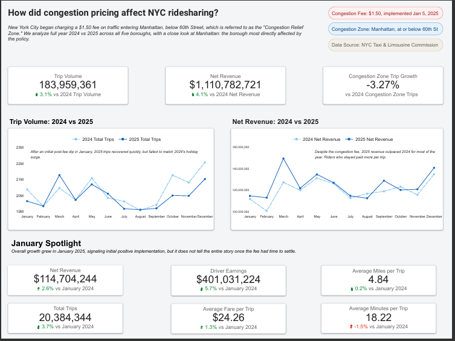
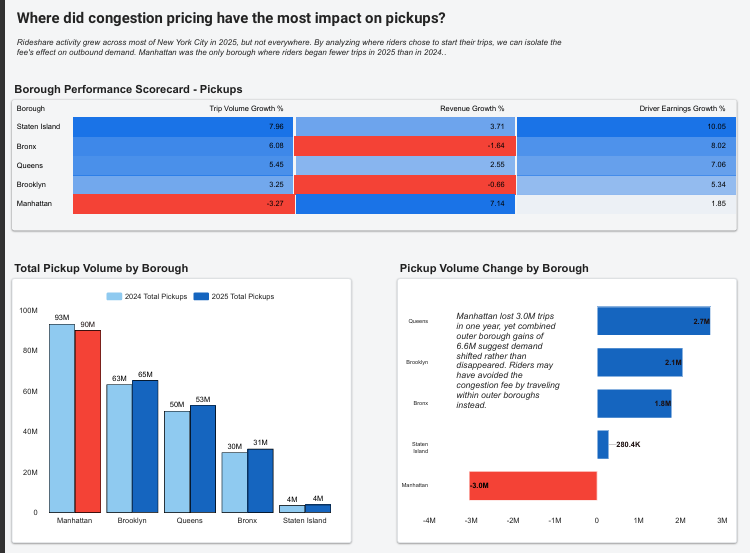
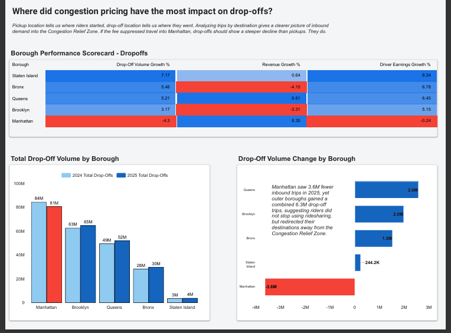
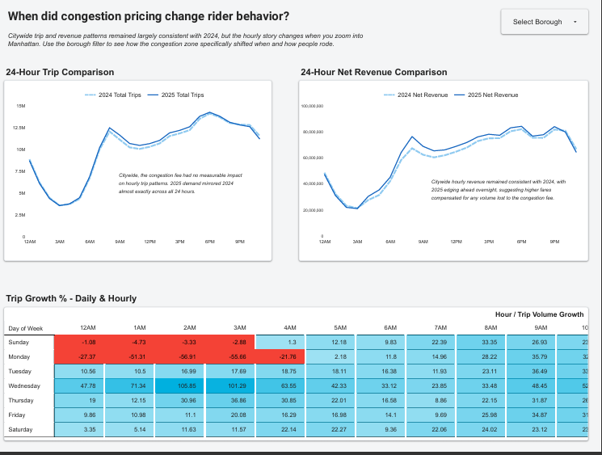

---

## Data Source

The data is from the [NYC Taxi and Limousine Commission](https://www.nyc.gov/site/tlc/about/tlc-trip-record-data.page), where each month has records of all ridesharing trips, whether from ridesharing companies or taxi services. The months covered in this analysis are **January through December 2024** and **January through December 2025**, providing a true full year comparison on both sides of the congestion fee implementation. In total, the data contains over **400 million records** across both years.

---

## Data Dictionary

Part 2's data dictionary remains unchanged as the tables are the same as Part 1:

**High Volume FHV Trip Records (2024)**
| Column | Type | Description |
|--------|------|-------------|
| hvfhs_license_num | STRING | TLC license number of the HVFHS base |
| dispatching_base_num | STRING | TLC base number of the dispatching base |
| originating_base_num | STRING | TLC base number of the originating base |
| request_datetime | TIMESTAMP | Date and time of trip request |
| on_scene_datetime | TIMESTAMP | Date and time driver arrived |
| pickup_datetime | TIMESTAMP | Date and time of pickup |
| dropoff_datetime | TIMESTAMP | Date and time of dropoff |
| PULocationID | INT | Pickup taxi zone ID |
| DOLocationID | INT | Dropoff taxi zone ID |
| trip_miles | FLOAT | Trip distance in miles |
| trip_time | INT | Trip duration in seconds |
| base_passenger_fare | FLOAT | Base fare before fees |
| tolls | FLOAT | Toll charges |
| bcf | FLOAT | Black car fund fee |
| sales_tax | FLOAT | Sales tax |
| congestion_surcharge | FLOAT | NYS congestion surcharge |
| airport_fee | FLOAT | Airport surcharge |
| tips | FLOAT | Tip amount |
| driver_pay | FLOAT | Total driver pay |
| shared_request_flag | STRING | Rider requested shared ride |
| shared_match_flag | STRING | Rider matched for shared ride |
| access_a_ride_flag | STRING | MTA Access-a-Ride trip |
| wav_request_flag | STRING | Wheelchair accessible vehicle requested |
| wav_match_flag | STRING | Wheelchair accessible vehicle matched |

**High Volume FHV Trip Records (2025 additions)**
| Column | Type | Description |
|--------|------|-------------|
| cbd_congestion_fee | FLOAT | Congestion pricing fee for CBD trips |

**taxi_zones**
| Column | Type | Description |
|--------|------|-------------|
| LocationID | INT | Unique zone identifier |
| borough | STRING | NYC borough name |
| zone | STRING | Neighborhood zone name |

---

## Key Findings

**The unexpected finding:** Despite losing **3.0M trips** by pickup location, Manhattan net revenue grew **+7.14% YoY**. Fewer riders traveled into the congestion zone, but the ones who did paid more. The fee reshaped who rides into Manhattan, not just how many.

### Overall Citywide Trends

- **Citywide trip volume grew across the full year:** Total trips across NYC grew **+3.1% YoY** to **183,959,361**, driven entirely by outer borough growth. *2025 trips recovered above 2024 levels by March after an initial post-fee dip in January, but failed to match 2024's holiday surge in November and December.*

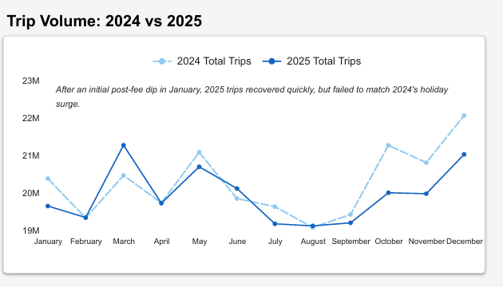

- **Citywide revenue outpaced trip growth:** Net revenue reached **$1,110,782,721** in 2025, growing **+4.1% YoY** despite trips growing only **+3.1%**, meaning revenue grew faster than volume. *2025 revenue outpaced 2024 for most of the year, peaking in March before softening through summer and recovering in fall.*

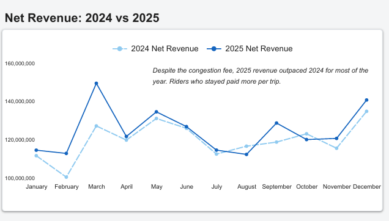

- **January 2025 showed initial resilience across all metrics:** In the first full month of the fee, total trips grew **+3.7%**, net revenue grew **+2.6%**, driver earnings grew **+5.7%**, and average fare grew **+1.3%** compared to January 2024. *Average trip minutes dropped **-1.5%**, suggesting slightly faster trips post-fee. Overall growth in January signals initial positive implementation, but it does not tell the entire story once the fee had time to settle.*

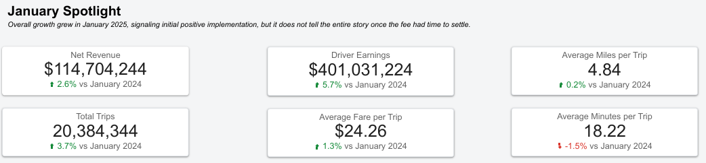

- **The congestion fee changed where people rode, not when:** Citywide hourly trip and revenue patterns in 2025 were nearly identical to 2024 across all 24 hours and all seven days of the week. *The fee did not change rider behavior by time of day at a citywide level. Use the borough filter on the dashboard to see how patterns shift when isolating Manhattan specifically.*

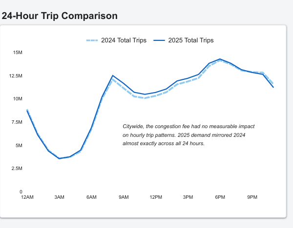
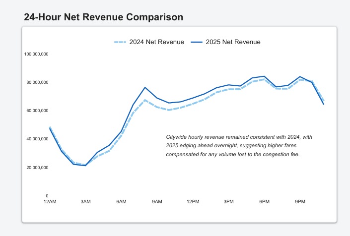
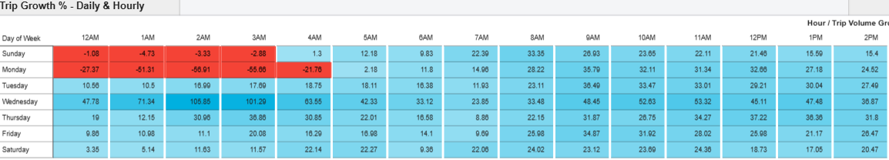

### Pickup Analysis — Where Did Riders Start Their Trips?

*Pickup location captures where riders chose to begin their journey. A decline in Manhattan pickups means fewer riders started trips from within the Congestion Relief Zone.*

- **Manhattan was the only borough where riders began fewer trips in 2025:** By pickup location, Manhattan trip volume declined **-3.27% YoY**, the only borough to post a negative result. Every outer borough grew — *Staten Island (+7.98%), Bronx (+6.08%), Queens (+5.45%), and Brooklyn (+3.25%).*

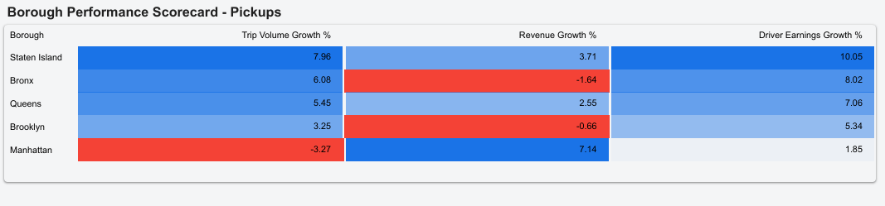

- **Manhattan lost 3.0M pickup trips while outer boroughs gained 6.6M:** The scale of the shift confirms demand displacement rather than suppression. *Riders did not stop using rideshare. They stopped starting trips from Manhattan.*

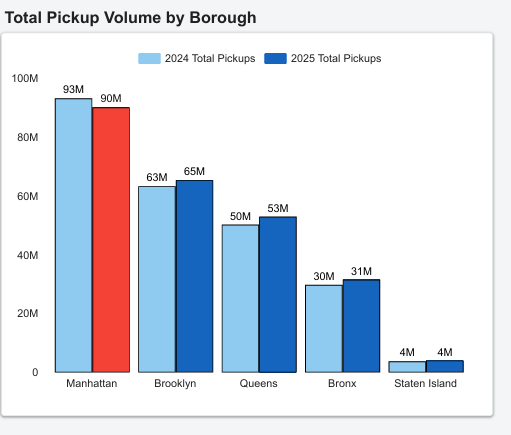
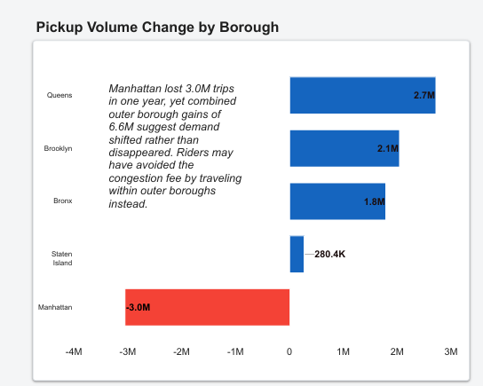

- **Manhattan pickup revenue and earnings still grew despite fewer trips:** By pickup location, Manhattan net revenue grew **+7.14% YoY** and driver earnings grew **+1.85%**, the lowest of any borough but still positive. *Higher per-trip fares on remaining Manhattan pickups offset the volume loss, suggesting the fee filtered out lower-value trips while retaining higher-value ones.*

### Dropoff Analysis — Where Did Riders End Their Trips?

*Pickup analysis tells us where riders started. Dropoff analysis tells us where they went. Since the congestion fee applies to trips entering Manhattan below 60th Street, a decline in Manhattan dropoffs is a more direct measure of the fee's suppressive effect than a decline in pickups.*

- **Manhattan saw a steeper decline in dropoffs than pickups:** By dropoff location, Manhattan trip volume declined **-4.3% YoY**, compared to **-3.27%** by pickup location. *The fee had a stronger suppressive effect on inbound travel into the congestion zone than on outbound travel out of it.*

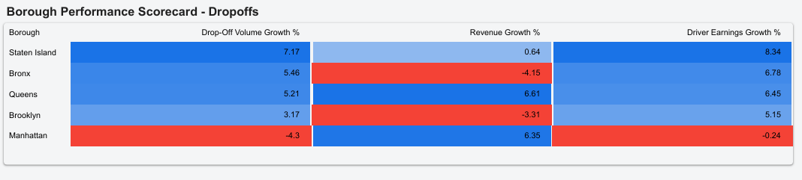

- **Outer boroughs absorbed inbound demand as well as outbound:** By dropoff location, outer boroughs gained a combined **6.6M trips** in 2025, mirroring the pickup displacement pattern. *Riders redirected their destinations away from Manhattan, not just their starting points. The displacement finding holds from both directions.*

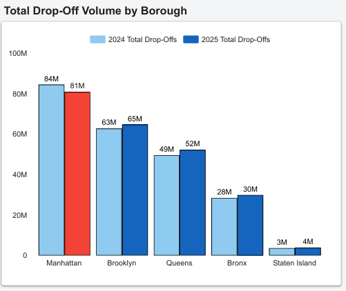
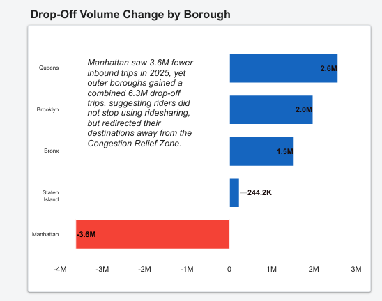

- **Manhattan dropoff driver earnings turned slightly negative:** By dropoff location, Manhattan driver earnings declined **-0.24% YoY**, compared to **+1.85%** for pickups. *Drivers making inbound Manhattan trips felt the fee's impact most directly. Notably, Manhattan dropoff revenue still grew **+6.35% YoY**, consistent with the pickup finding that fewer but higher-value trips defined the congestion zone in 2025.*

---

## Revenue Impact

The expected story was that a new fee would reduce revenue. The data disagreed, and the reason why matters.

Citywide trips grew **+3.1%** while revenue grew **+4.1%**, meaning revenue outpaced volume. This divergence is the most important financial signal in the analysis. It points to a structural shift in trip composition: the congestion fee appears to have removed lower-value trips from the market while retaining higher-value ones. Riders who continued traveling into Manhattan paid more per trip, and that premium more than offset the volume loss.

This pattern was consistent across both directions of Manhattan travel. Pickup revenue grew **+7.14% YoY** and dropoff revenue grew **+6.35% YoY**, confirming the dynamic was not isolated to one type of Manhattan journey. The January spotlight reinforces this further, as average fare grew **+1.3%** and driver earnings grew **+5.7%** in the very first month of the fee, suggesting the higher per-trip value was immediate rather than gradual.

Driver earnings reflected the same divided story seen in trip volume. Outer borough drivers benefited most, with Staten Island (+10.05%), Bronx (+8.02%), and Queens (+7.06%) leading earnings growth. Manhattan pickup earnings grew **+1.85%**, positive but the lowest of any borough. Dropoff earnings in Manhattan turned slightly negative at **-0.24%**, the only metric in this analysis to register a true decline, highlighting the specific pressure felt by drivers serving inbound congestion zone trips.

The seasonal arc of 2025 revenue followed a recognizable pattern: peaking in March, softening through summer, recovering in fall,  suggesting the fee's impact was absorbed into normal market behavior rather than creating ongoing disruption. The one exception was the holiday season, where 2025 failed to match 2024's November and December surge, leaving a gap that warrants monitoring heading into 2026.

---

## Recommendations

- **Protect Manhattan rider retention with fare transparency:** Manhattan trip volume declined while revenue grew, meaning riders who stayed paid more per trip. To prevent further churn among price-sensitive riders, ridesharing companies should introduce *clear fee breakdowns at the booking stage*, showing riders exactly how much of their fare is attributable to the congestion fee rather than base pricing.

- **Incentivize drivers to cover inbound Manhattan routes:** Dropoff earnings in Manhattan turned slightly negative at **-0.24%**, making inbound Manhattan trips less attractive for drivers. *A congestion-specific pay boost for trips ending in the Congestion Relief Zone* would stabilize driver supply on the routes most directly affected by the fee.

- **Capitalize on outer borough demand growth:** Queens, Brooklyn, and the Bronx absorbed millions of displaced Manhattan trips in 2025. *Targeted driver incentives and rider promotions in these boroughs* would accelerate organic growth that is already occurring, reducing dependence on Manhattan as the primary revenue source.

- **Develop a holiday season retention strategy:** Trip volume failed to match 2024 levels in November and December despite recovering strongly through the rest of the year. *A holiday-specific loyalty campaign targeting frequent Manhattan riders* could recover the seasonal gap before it becomes a structural trend.

- **Monitor the inbound vs outbound earnings gap:** Manhattan dropoff earnings declined while pickup earnings grew. *If this gap widens in 2026, driver supply for inbound Manhattan trips may deteriorate*, creating service quality issues in the city's highest demand area at peak times.

- **Use the January signal as an early warning benchmark:** January 2025 showed growth across all metrics immediately after the fee launched. *Tracking January 2026 against January 2025* will reveal whether the market has fully adapted or whether delayed behavioral shifts are still emerging.

---

## Limitations

- **Pickup location as a proxy for 2024 congestion zone trips:** The `cbd_congestion_fee` column, which directly identifies trips subject to the congestion fee, *only exists in the 2025 dataset*. For 2024, Manhattan borough based on pickup location was used as a proxy for the congestion zone. This introduces some imprecision, as not all Manhattan pickups originate below 60th Street and not all congestion zone trips originate within Manhattan.

- **Dropoff analysis uses borough-level geography:** Dropoff analysis in this project is conducted at the *borough level rather than the zone level*. Trips ending in Manhattan are not all ending within the Congestion Relief Zone, as some may end above 60th Street and would not be subject to the fee, introducing the same geographic imprecision as the pickup proxy.

- **Year-over-year comparisons do not control for external factors:** The 2024 vs 2025 comparison does not control for external factors that may have independently influenced rideshare demand. *Macroeconomic conditions, MTA service changes, weather anomalies, and platform-level pricing decisions by Uber and Lyft could all have contributed to the patterns observed*, making it difficult to attribute changes solely to the congestion fee.

- **December 2024 holiday effect on the full year baseline:** December is historically the highest volume month for NYC rideshare. *Including a full December 2024 in the baseline may slightly inflate the 2024 annual totals*, making 2025 growth appear more modest than it would under a seasonally adjusted comparison.

- **Part 2 does not capture individual company performance:** This analysis treats all rideshare trips as a single market. *Uber and Lyft may have responded differently to the congestion fee* through pricing adjustments, driver incentives, or promotional campaigns. This limits the analysis to market-level conclusions and may obscure platform-specific responses to the fee.

---

## Next Steps: Part 3

This analysis represents Part 2 of a broader investigation into NYC congestion pricing's impact on rideshare behavior. Part 1 captured the immediate shock of the fee through a quasi-experimental design. Part 2 expanded to a full year-over-year comparison, revealing that *demand shifted rather than disappeared*, and that Manhattan's trip composition changed more than its overall revenue.

The bigger question this analysis raises is whether congestion pricing is an effective tool for reshaping urban mobility without destroying the market it targets. The NYC data suggests it may be. Part 3 will test whether that pattern holds when the market is split by platform.

Part 3 will examine whether **Uber and Lyft** responded differently to the congestion fee, and whether riders showed any platform preference as a result. Specifically, Part 3 will examine:

- Whether Uber or Lyft absorbed a greater share of displaced Manhattan trips
- How each platform's *pricing and driver incentive strategies* responded to the fee environment
- Whether peak hour demand shifted between platforms after the fee took effect
- Which platform retained Manhattan riders more effectively through the post-fee period
- How driver earnings compared between platforms in and outside the Congestion Relief Zone
